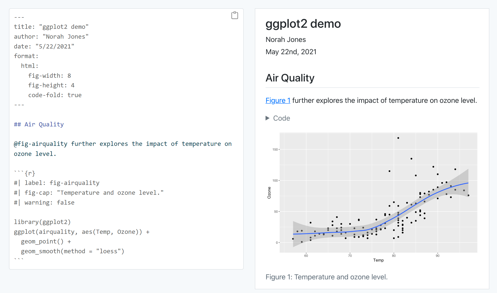
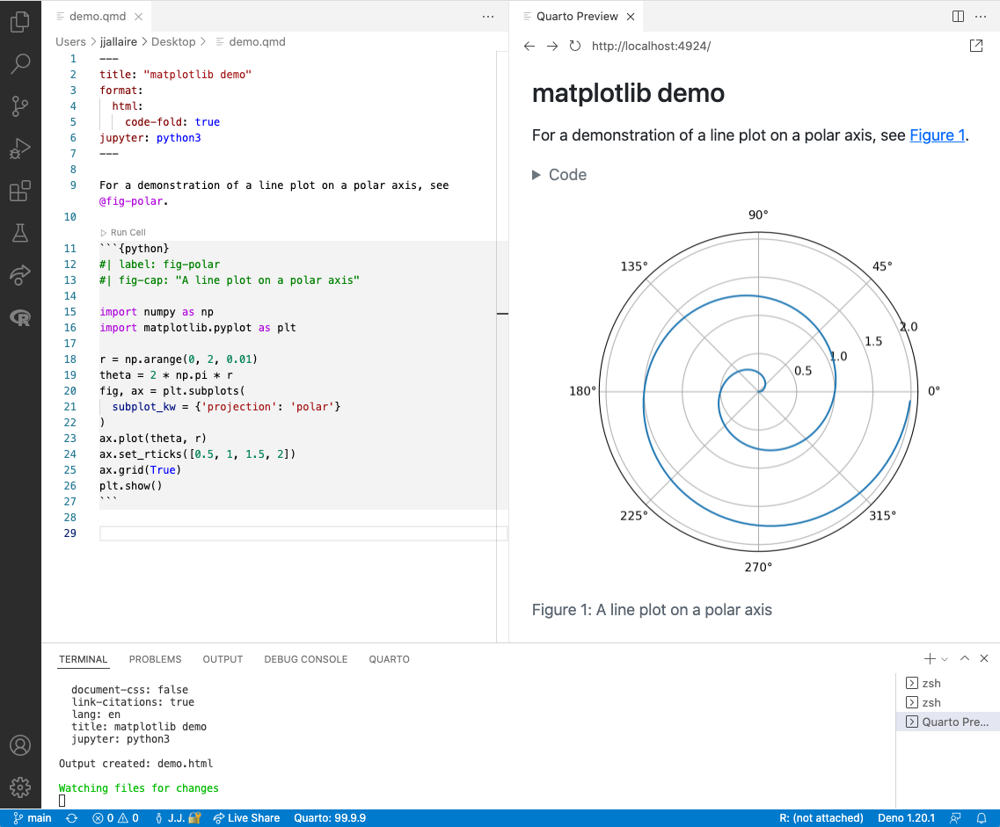
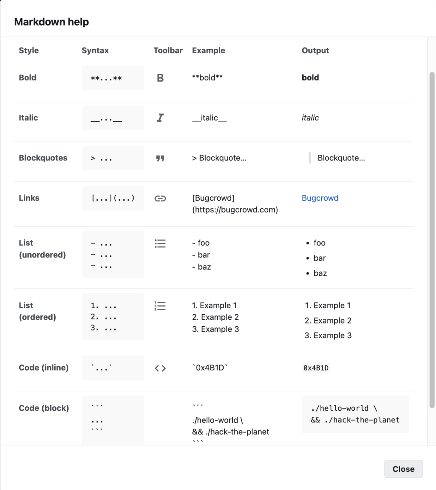
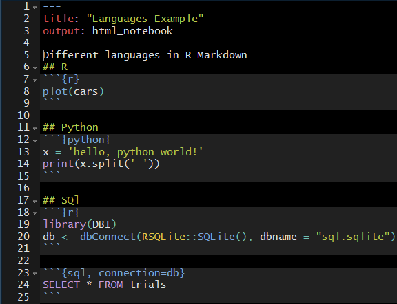

class: title-slide, inverse  
count: false

<style>
/* @import url('https://fonts.googleapis.com/css2?family=Patrick+Hand&display=swap');
@import url('https://fonts.googleapis.com/css2?family=Short+Stack&display=swap');
@import url('https://fonts.googleapis.com/css2?family=Dekko&display=swap');
@import url('https://fonts.googleapis.com/css2?family=Sue+Ellen+Francisco&display=swap');
*/

@import url('https://fonts.googleapis.com/css2?family=Walter+Turncoat&display=swap');

@import url('https://fonts.googleapis.com/css2?family=Sniglet&display=swap');
::selection {
  background: #599BFFAD; /* WebKit/Blink Browsers */
  color: #fafafa;
}

.title-slide {
background-image: url(assets/blackboard.png);
/*background-image: url(assets/titleback.jpg);*/
background-size: cover;
}

.title-slide .remark-slide-number {
  display: none;
}

.intslide h1:after {
    content: "";
    display: block;
    height: 40px;
    background-image: url(assets/border.png);
    background-repeat: no-repeat;
    background-position: center bottom;
}

.remark-slide-container{
background: #444;
}
.remark-slide-content h1 {
    font-size: 46px;
    font-family: 'Walter Turncoat', cursive;
    color: #cacaca;
    margin-bottom:1px;
    margin-top:20px;
}
.remark-slide-content {
    font-size: 20px;
    font-family: 'Sniglet', cursive;
    color: #cacaca;
}

.hljs-monokai .hljs {
	 	margin-bottom: 20px;
    border-left: 5px solid #89c433;
    color: #F9F2DE;
    background-color: #363537;
    box-shadow: inset -2px 0px 6px 2px #171515;
}


/* unvisited link */
a:link {
  color: #fafafa;
  border-bottom: 2px solid #fafafa;
}

/* visited link */
a:visited {
  color: #fafafa;
  border-bottom: 2px solid #f18787;

}

/* mouse over link */
a:hover {
  color: #fafafa;
  border-bottom: 2px solid #f18787;

}

/* selected link */
a:active {
  color: #fafafa;
  border-bottom: 2px solid #f18787;

}
</style>

</img>
<br></br>
<h1 class="center" style="color: #dadada;font-size: 50px;">Class 2: Reproducible Research</h1>


```{r setup, include=FALSE}
options(htmltools.dir.version = FALSE)
# library(icons)
chunk <- "```"
inline <- function(x = "") paste0("`` `r ", x, "` ``")
library(tidyverse)
```


---
layout: true
background-image: url(assets/bb2.png)
background-size: cover
---
class: intslide
# What is Quarto?


 A reproducible authoring framework for data science, combining your code, its results, and your prose. 
<br><br><br><br>
--

# Why do we care about reproducible work?

* In 2016, Nature conducted a survey of 1,576 researchers 

* more than 70% of researchers have tried and failed to reproduce another scientist's work!

* more than half have failed to reproduce their own work!!!

---
class: intslide
# Why would you use Quarto?


1. For communicating to decision-makers, who want to focus on the conclusions, not the code behind the analysis.<br>
<br><br>
<br>
--
2. For collaborating with other colleagues, who are interested in both your conclusions, and how you reached them (i.e. the code).<br>
<br><br>
<br>
--
3. As an environment in which to do data analysis, as a modern-day lab notebook where you can capture not only what you did, but also what you were thinking.

---
class: intslide

# How do we use quarto? with R



---
class: intslide

# How do we use quarto? with python


---
class: intslide
# Quarto Output Formats
.pull-left[]
.pull-right[Your Quarto file can be exported as a
1. HTML
2. PDF
3. MS Word, ODT RTF
4. html or Powerpoint slides
5. Interactive webpage
6. Website, Blog, Books
7. Several other custom formats epubs, wikis etc
]

<br><br><br><br>
<br>


<span style="font-size:0.5em;">Artwork from "Hello, Quarto" keynote by Julia Lowndes and Mine Çetinkaya-Rundel, presented at RStudio Conference 2022. Illustrated by Allison Horst.</span>
---
class: intslide
# Exercises

1. Create a new Quarto Document.

2. Create create outputs to formats: HTML, PDF and Word. (You may need to install LaTeX in order to build the PDF output)

---
class: intslide
# Text Formatting using Markdown
.pull-left[
]
.pull-right[* Text formatting language
* Include images
* Include Equations
* Display Tables


 [Markdown Reference guide](https://quarto.org/docs/authoring/markdown-basics.html)
]


---
class: intslide
#Quarto Markdown 

A .qmd file contains three important types of content:

1. YAML

2. Text formatting

3. Code chunks

---
class: intslide
# YAML - Yet Another Markup Language

```yaml
---
title: "An Example Using R Markdown"
author: "John Smith"
date: 22/10/2016
output: html_document
---
```
[Reference](https://quarto.org/docs/output-formats/all-formats.html) for all yaml options for Quarto documents

```yaml
---
title: "My Document"
format: 
  html:
    toc: true
    code-fold: true
---
```


---
class: intslide
# Code Chunks- Languages

.pull-left[R markdown supports the following and many other languages:

  * Python
  * SQL
  * Bash
  * Rcpp
  * Stan
  * JavaScript
  * CSS

To see the whole list use
```{r, eval = F}
  names(knitr::knit_engines$get())
```
]
  
.pull-right[
  
  ]
  
---
class: intslide
# Tables

By default, R Markdown prints data with paging in the html format.

Exercise : Try printing a data set.

Additional Options using DT and formattable packages.


We will come back to this later.


---
class: intslide
# Inline code

* There is one other way to embed R code into an Quarto document: directly into the text, with: `r inline()`. 

* This can be very useful if you mention properties of your data in the text.

><span style="font-size:1em;">We have data about `r inline('nrow(diamonds)')` diamonds. 
 Only `r inline('nrow(diamonds) - nrow(smaller)')` are larger 
than 2.5 carats. The distribution of the remainder is shown below:</span>

* When the report is knit, the results of these computations are inserted into the text:

><span style="font-size:1em;">We have data about 53940 diamonds. Only 126 are larger than 
2.5 carats. The distribution of the remainder is shown below:</span>


